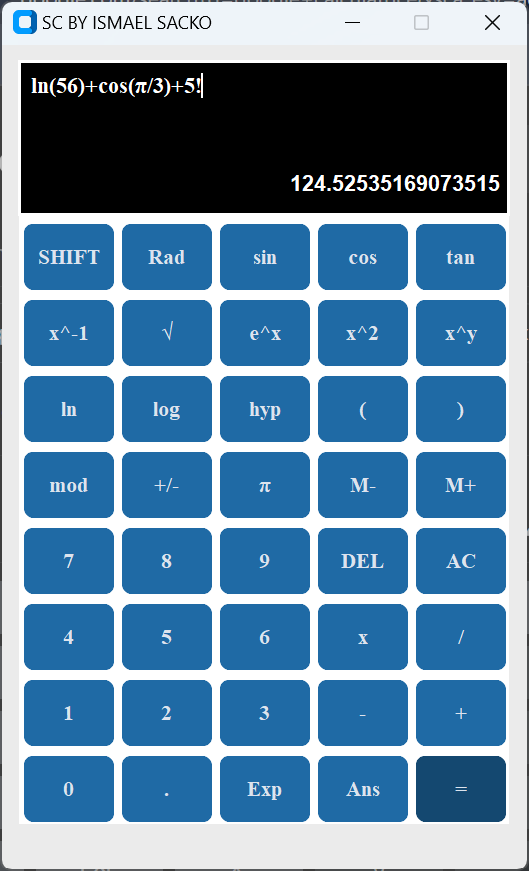
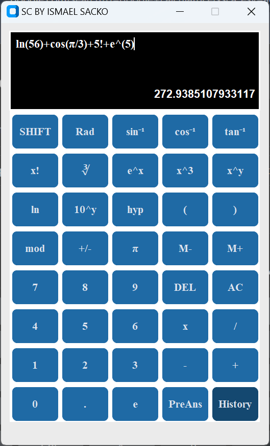
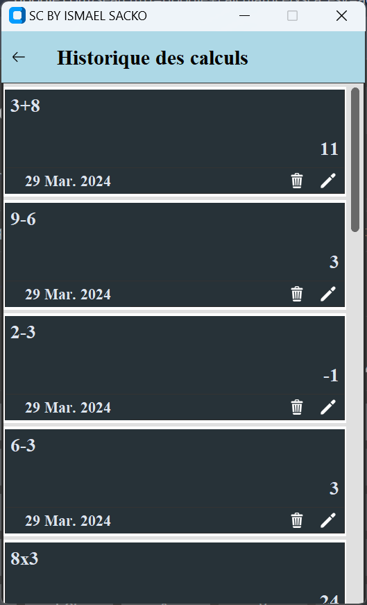

# Python Calculatriceoooooooo

C’est une application développée à l’aide de la bibliothèque d'interface utilisateur graphique <strong>CustomTkinter</strong> du langage de programmation Python.
Elle permet d’effectuer des calculs simples mais aussi des calculs beaucoup plus complexes notamment grâce à des fonctions mathématiques. Elle dispose en plus d’un historique des calculs gérer par un système de fichier qui permet une sauvegarde permanente.

## Présentation de l'application

